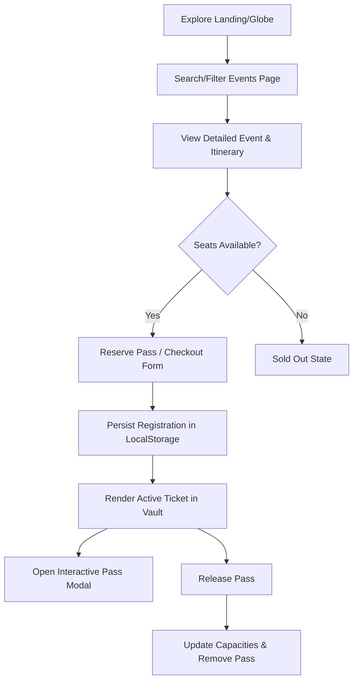
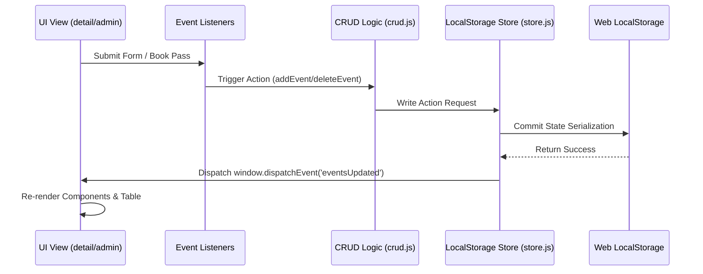

# Conclave
> Immersive Event Discovery & Management Platform

Conclave is an immersive, client-side event discovery and administration platform. Built with vanilla web technologies, it features a WebGL 3D global venue map, a rule-based AI-like conversational concierge, fluid mouse-interactive animations, and an organizer dashboard with an interactive drag-and-drop itinerary constructor and local image upload support.

This application is frontend-only, utilizing `LocalStorage` for data persistence, registrations, and administrative CRUD operations, operating with zero external database dependencies.

---

## Overview

Conclave is built to bridge the gap between high-aesthetic visual experiences and operational utility. Designed for premium events, it offers two primary portals:
- **Member Space**: An interactive experience where guests can query the conversational assistant, visually navigate venues across the globe on a 3D Earth, explore curated events using custom category/date filters, and claim personalized, barcode-equipped passes.
- **Admin Command**: A functional interface for event organizers to orchestrate events, manage registrations, track real-time attendee statistics, build event itineraries dynamically via drag-and-drop elements, and upload visual media.

---

## Key Features

### 1. Interactive 3D Venue Discovery
* **WebGL Globe Rendering**: Integrates `Globe.gl` and `Three.js` to render an interactive 3D Earth representing global venue coordinates.
* **Smart City Markers**: Procedurally maps event venues across major cities. Pins feature ambient pulsing animations, dynamic popups, and direct event details navigation.
* **Theme-Aware Textures**: Automatically changes globe topography, specular shininess lighting, and atmosphere hues to match light or dark modes.

### 2. Conversational Concierge Assistant
* **Natural Language Keyword Processing**: Word-boundary matching parses member inputs to deliver responses for different categories (greetings, pricing, categories, specific dates).
* **Multi-stage Fallback & Escalation**: Tracks consecutive unanswered queries (`fallbackStreak`) to gradually escalate help—providing upcoming event suggestions, direct page navigations, and category suggestions.
* **Local Session Memory**: Persists conversation logs in `LocalStorage` to maintain chat history across page refreshes.

### 3. Comprehensive Event Registration
* **Checkout Simulation**: Provides an in-app billing form supporting Conclave Pay (card), UPI scans, and simulated Net Banking logins.
* **Personal Ticket Vault**: Lists active registrations inside a card-based ticket view. Members can reveal their interactive passes (with unique codes and barcodes) or release passes to free up event capacity.
* **State Syncing**: Employs storage listeners to automatically update reservations across multiple browser tabs in real-time.

### 4. Admin Management Dashboard
* **Event CRUD**: Full capabilities to add, edit, or delete custom event listings, which instantly merge into default lists.
* **Interactive Itinerary Builder**: A drag-and-drop timeline editor allowing organizers to add, delete, and rearrange scheduled itinerary slots.
* **Drag-and-Drop Base64 Image Uploader**: Allows dragging visual images directly into the form. Converts files to base64 data strings for direct persistence in `LocalStorage` alongside default URLs.
* **Counters & Metrics**: Displays count stats (Total Events, Total Attendees, and unique Categories) using easing counter animations.

### 5. Immersive Design Foundations
* **Micro-Animations**: Mouse-responsive 3D tilt effects on card overlays, magnetic cursor pull on buttons, scroll progress tracking, and text scramble reveals.
* **Fluid Page Transitions**: Injects a custom fade overlay that intercepts page hops, rendering cinematic out-of-screen transitions before load.

---

## Screens / Modules

- **Landing Hub (`index.html`)**: Immersive entrance featuring character-by-character text reveals, particle canvas backgrounds, sliding pill navigations, and bento-grid featured collections.
- **Events Explorer (`pages/events.html`)**: The primary events directory. Supports responsive category drawer panels, text-based search, and date pickers.
- **Detail Gateway (`pages/event-detail.html`)**: Details event itineraries, metadata, remaining seat counters, and hosts the reservation checkout modal.
- **My Bookings Portal (`pages/bookings.html`)**: The user's active pass directory. Generates interactive ticket passes and manages booking cancellations.
- **Venues Globe (`pages/venues.html`)**: A full-screen 3D WebGL projection displaying city coordinates with interactive popup cards.
- **Settings Panel (`pages/settings.html`)**: Segmented user preferences panel managing profile parameters (Name, Email) and billing credentials (Cards, UPI IDs) with instant sidebar synchronization.
- **Admin Portal (`admin.html`)**: The organizer dashboard hosting metrics, the event database table, delete confirmations, and the creator form modal.

---

## User Roles

| Role | Permissions & Access | Core Responsibilities |
|---|---|---|
| **Member Guest** | Pages: Home, Events, Details, Bookings, Venues, Settings.<br>Can search/filter events, converse with the assistant, edit profile, and book/release event passes. | Explore upcoming experiences, manage personal bookings, and update personal account settings. |
| **Event Administrator** | Pages: Admin Dashboard (`admin.html`), including all editor modals.<br>Can perform full CRUD operations on events, drag-and-drop itineraries, upload images, and check total metrics. | Formulate event plans, create listings, monitor capacities, and handle schedule edits. |

---

## User Workflow



---

## Technical Stack

* **Languages**: HTML5, CSS3 (Custom Design Tokens), JavaScript (ES6 Modules)
* **Libraries & CDNs**:
  - `Three.js` (r128) & `Globe.gl` (3D webGL visualization)
  - `FontAwesome` v6.4.0 (Vector Icons)
  - `Google Fonts` (Montserrat, Inter)
* **Storage Engines**: `Web LocalStorage` (Structured key-value serialization)
* **Build/Package Manager**: None (Pure client-side static application)

---

## Folder Structure

```text
├── admin.html                    # Admin Dashboard Portal
├── index.html                    # Landing Hub (Home Page)
├── Part_5_Admin_Dashboard_CRUD.md# Admin Specifications Documentation
├── README.md                     # Project Technical Documentation
├── assets/
│   ├── icons/                    # SVG UI Vector Icons
│   └── img/                      # Globe Textures, Starfields, and Earth Maps
├── css/
│   ├── admin.css                 # Admin Panel layout & CRUD styles
│   ├── chat.css                  # Assistant chat interface styling
│   └── styles.css                # Immersive design tokens & system variables
├── js/
│   ├── admin/
│   │   ├── adminApp.js           # Admin controller
│   │   ├── crud.js               # CRUD logic delegator
│   │   ├── eventForm.js          # Itinerary builder, validations, image drops
│   │   └── eventTable.js         # Admin table rendering
│   ├── components/
│   │   └── modal.js              # Standard modal overlay controller
│   ├── data/
│   │   ├── categories.js         # Constant category metadata
│   │   └── events.js             # Initial built-in events data
│   ├── features/
│   │   ├── chat.js               # Concierge chatbot & fallback streak manager
│   │   └── filtering.js          # Search and explore filtering definitions
│   ├── state/
│   │   ├── appState.js           # Global user state constants
│   │   └── store.js              # LocalStorage store engine & dispatchers
│   ├── utils/
│   │   ├── errorHandler.js       # Safe execute wrappers & logger
│   │   ├── helpers.js            # Date formatters & unique ID generators
│   │   ├── storageKeys.js        # Unified LocalStorage keys mapping
│   │   └── validators.js         # Form field & capacity validation rules
│   ├── animations.js             # Magnetic, tilts, reveals, text scramble
│   ├── app.js                    # Global app loader, themes, particles
│   ├── page-transition.js        # Internal link intercepts & page fades
│   ├── sidebar.js                # Self-injecting persistent navigation sidebar
│   ├── toast.js                  # Global toast notifications (success/info/error)
│   └── venues-globe.js           # Three-Globe location mapping
└── pages/
    ├── bookings.html             # Member ticket vault
    ├── checkout.html             # Purchase simulation (embedded)
    ├── event-detail.html         # Event profile details & itinerary
    ├── events.html               # Curated events index
    ├── settings.html             # Profile & billing tab control
    └── venues.html               # Venues WebGL globe viewport
```

---

## Installation

Because Conclave is a client-side, vanilla web application, no dependency compilation or installation is necessary.

### 1. Clone the repository
```bash
git clone https://github.com/LeapX-Pune/event-ops.git
cd event-ops
```

### 2. Launch Local Server
The browser blocks local file imports (`CORS` policy) when executing modules via the `file://` scheme directly. Run a local server from the root directory to access the application.

* **Using Python 3**:
  ```bash
  python3 -m http.server 5050
  ```
  *(Access the portal at [http://localhost:5050](http://localhost:5050))*

* **Using Node.js (via npx)**:
  ```bash
  npx http-server -p 5050
  ```
  *(Access the portal at [http://localhost:5050](http://localhost:5050))*

---

## Usage

### User Registration Simulation
1. Launch the server and navigate to `index.html`.
2. Browse events on the **Events** or **Venues** (Globe) page.
3. Select an event card, check details, and click **Reserve Pass**.
4. Fill out checkout credentials. Upon confirmation, navigate to **My Bookings** to view your active ticket.
5. In **Settings**, change your credentials and watch them update live in the profile sidebar drawer.

### Admin Operations Flow
1. Open the profile sidebar and click **Admin Dashboard**.
2. Click **Create New Event** to open the creation overlay.
3. Fill in details: drag and drop an itinerary sequence, upload a cover image, and save.
4. Locate the event in the table to modify its parameters or remove it entirely.

---

## Project Architecture

Conclave operates on a decoupled data-and-view flow. Data flows from state managers to UI controllers, updating local structures on request.



- **LocalStorage Engine (`js/state/store.js`)**: Serves as the single source of truth, merging static JS listings with dynamic local updates.
- **State Synchronization**: Page scripts register listeners to `window.addEventListener('storage', ...)` and `eventsUpdated` to instantly update the UI when changes occur in separate tabs.

---

## Design System

Conclave relies on a custom CSS-variable design system in `css/styles.css`, establishing a unified language for themes, spacing, and animations:

### Spacing Scale
Uses a base-8 scaling system:
- `--space-xs`: `4px` | `--space-sm`: `8px` | `--space-md`: `16px` | `--space-lg`: `24px` | `--space-xl`: `32px` | `--space-2xl`: `48px`

### Color Palette
- **Dark Theme (Default)**: Deep midnight primary colors (`--bg-void: #0a0a12`, `--bg-deep: #0e0e1a`), paired with gold (`--gold: #E6C687`) and violet (`--violet: #7B68EE`) accents.
- **Light Theme**: Contrast-friendly parchment background colors (`--bg-void: #F8F6F2`, `--bg-deep: #F2EEE7`), matching gold highlights with text readability.

### Interaction Micro-Animations
- **Element Tilt**: Mouse coordinate tracking creates 3D perspectives on event cards.
- **Magnetic Buttons**: Pulls interactive action items slightly toward the cursor coordinates.
- **Text Scramble**: Replaces characters with random letters before locking in headings.

---

## Performance Considerations

- **Asset Pre-fetching**: Heavy 3D assets (Earth maps, starry space textures) and Three.js CDN scripts are pre-fetched in the background (`link rel="prefetch"`) 2 seconds after home page initialization.
- **Interactive Bounds**: Mouse tilt animations are bound to passive scroll parameters and transition constraints to avoid frame drops on slower devices.
- **Image Conversion**: The admin uploader converts files to compressed base64 strings to balance local storage allocations.

---

## Future Enhancements

- **Persistent Remote Database**: Port the data storage adapters from client-side local structures to Postgres/MySQL.
- **OAuth User Profiles**: Replace simulated guest settings with secure authorization wrappers (e.g., Supabase, Auth0).
- **Physical QR Code Check-ins**: Integrate ticket validators scanning local ticket passes in real time.

---

## Contributing

1. Fork the project repository.
2. Create a feature branch: `git checkout -b feature/NewFeature`.
3. Commit adjustments: `git commit -m "feat: Add new user profile setting"`.
4. Push to branch: `git push origin feature/NewFeature`.
5. Open a Pull Request targeting the `develop` branch.

---

## License

Distributed under the MIT License. See the `LICENSE` file for more information.

---

## Authors / Credits

Conclave was developed by the frontend engineering team at LeapX:
- **Devansh Mittal**
- **Kshitij Das**
- **Pulak Saha**
- **Sankalp Tiwari**
- **Sauryaman Bisen**

---

## Acknowledgements

Special thanks to the LeapX Internship Program mentorship team, and contributors to the vanilla JS animation libraries, `Three.js` and `Globe.gl` communities.
